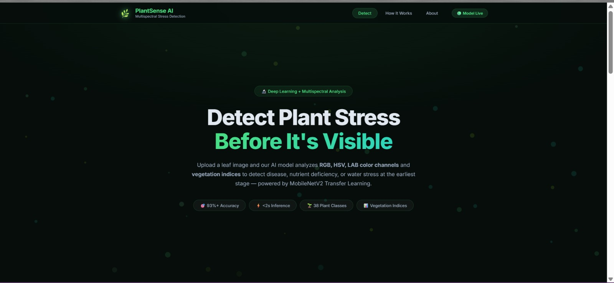
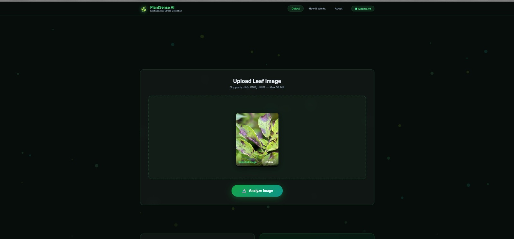
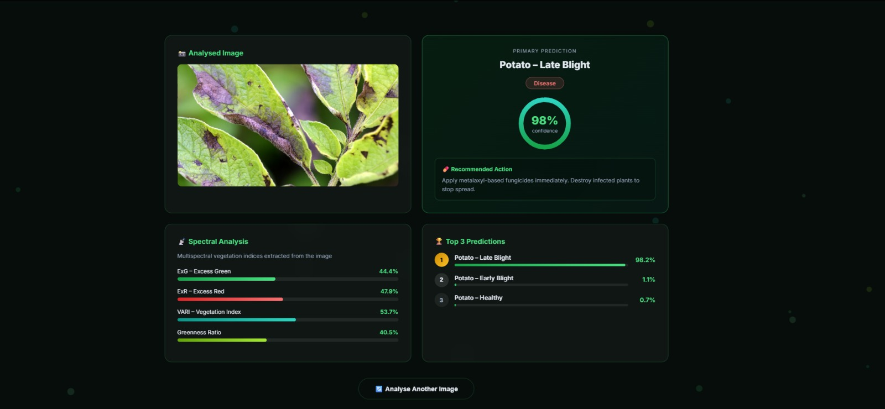

# 🌿 PlantSense-AI

PlantSense-AI is an AI-powered plant disease detection system that helps farmers and gardeners identify plant diseases using deep learning. Users can upload or capture an image of a plant leaf, and the model predicts the disease along with treatment recommendations.

---

## 🚀 Features

- 🌱 Plant disease detection using CNN
- 📷 Upload or capture leaf images
- 🤖 AI-based disease prediction
- 💊 Disease treatment recommendations
- 📊 Plant health tracking
- 💻 Responsive web interface

---

## 🛠️ Tech Stack

### Frontend
- React.js
- HTML
- CSS
- JavaScript

### Backend
- Flask (Python)

### AI/ML
- TensorFlow
- Keras
- Convolutional Neural Networks (CNN)

### Others
- NumPy
- OpenCV
- Git & GitHub

---

## 📂 Project Structure

```
PlantSense-AI
│
├── frontend/
├── model/
├── static/
├── app.py
├── train_model.py
├── requirements.txt
└── README.md
```

---

## ⚙️ Installation

Clone the repository

```bash
git clone https://github.com/Monisha-JR/PlantSense-AI.git
```

Navigate to the project

```bash
cd PlantSense-AI
```

Install dependencies

```bash
pip install -r requirements.txt
```

Run the application

```bash
python app.py
```

---

## 📸 Screenshots

## 📷 Screenshots

### Home Page



### Image Upload



### Disease Detection



---

## 👩‍💻 Author

**Monisha J R**

GitHub: https://github.com/Monisha-JR